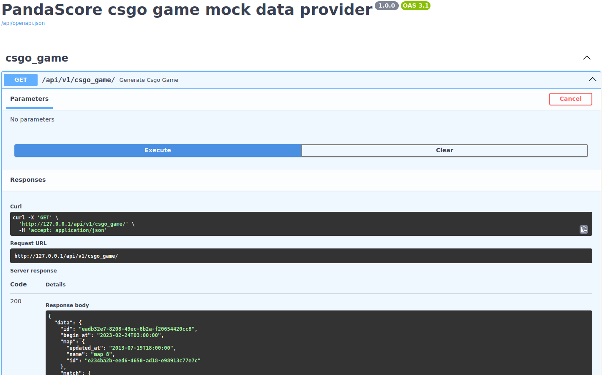

# Pandascore API mock data provider

### Technologies:
1. python3.12
2. poetry
3. fastapi
4. pydantic
5. asyncio
6. pytest
7. docker+docker-compose
8. nginx
9. sh
10. make
11. github workflows

### Patterns
1. factory
2. singleton
3. decorator
4. layered architecture(service+repository)
5. solid

### Structure
```
.
├── docker-compose.yaml
├── docker-entrypoint.sh
├── Dockerfile
├── docs
│   ├── openapi.json
│   └── swagger.png
├── main.py
├── Makefile
├── nginx
│   └── etc
│       └── nginx
│           ├── conf.d
│           │   └── default.conf.tmp
│           └── nginx.conf
├── poetry.lock
├── pyproject.toml
├── README.md
├── src
│   ├── data_provider
│   │   ├── api
│   │   │   └── v1
│   │   │       ├── csgo_game.py
│   │   │       ├── dependencies
│   │   │       │   ├── core
│   │   │       │   │   ├── __init__.py
│   │   │       │   │   ├── logger.py
│   │   │       │   │   └── settings.py
│   │   │       │   ├── __init__.py
│   │   │       │   ├── repositories
│   │   │       │   │   ├── __init__.py
│   │   │       │   │   ├── league.py
│   │   │       │   │   ├── map.py
│   │   │       │   │   ├── player.py
│   │   │       │   │   ├── round.py
│   │   │       │   │   ├── serie.py
│   │   │       │   │   ├── stat.py
│   │   │       │   │   ├── team.py
│   │   │       │   │   └── tournament.py
│   │   │       │   └── services
│   │   │       │       ├── csgo_game.py
│   │   │       │       ├── __init__.py
│   │   │       └── __init__.py
│   │   ├── app_factory.py
│   │   ├── core
│   │   │   ├── __init__.py
│   │   │   ├── logger
│   │   │   │   └── __init__.py
│   │   │   └── settings
│   │   │       ├── app.py
│   │   │       ├── data_provider
│   │   │       │   ├── __init__.py
│   │   │       │   ├── league.py
│   │   │       │   ├── map.py
│   │   │       │   ├── player.py
│   │   │       │   ├── serie.py
│   │   │       │   ├── team.py
│   │   │       │   └── tournament.py
│   │   │       ├── __init__.py
│   │   │       └── mixins
│   │   │           ├── base.py
│   │   │           ├── __init__.py      
│   │   ├── __init__.py
│   │   ├── interfaces
│   │   │   ├── core
│   │   │   │   ├── __init__.py
│   │   │   │   └── logger
│   │   │   │       └── __init__.py
│   │   │   ├── __init__.py
│   │   │   ├── repositories
│   │   │   │   └── __init__.py
│   │   │   └── services
│   │   │       └── __init__.py
│   │   ├── repositories
│   │   │   ├── __init__.py
│   │   │   ├── league.py
│   │   │   ├── map.py
│   │   │   ├── player.py
│   │   │   ├── round.py
│   │   │   ├── serie.py
│   │   │   ├── stat.py
│   │   │   ├── team.py
│   │   │   └── tournament.py
│   │   ├── schemas
│   │   │   ├── csgo_game.py
│   │   │   ├── __init__.py
│   │   │   ├── league.py
│   │   │   ├── map.py
│   │   │   ├── match.py
│   │   │   ├── mixins
│   │   │   │   ├── id.py
│   │   │   │   ├── __init__.py
│   │   │   │   ├── name.py
│   │   │   │   └── updated_at.py
│   │   │   ├── player.py
│   │   │   ├── round.py
│   │   │   ├── serie.py
│   │   │   ├── stat.py
│   │   │   ├── team_opponent_player_stat.py
│   │   │   ├── team.py
│   │   │   └── tournament.py
│   │   ├── services
│   │   │   ├── csgo_game.py
│   │   │   └── __init__.py
│   │   └── utils
│   │       ├── __init__.py
│   │       └── singleton.py
│   └── __init__.py
└── tests
    ├── __init__.py
    └── unit
        ├── conftest.py
        ├── __init__.py
        └── src
            ├── core
            │   └── test_logger.py
            ├── repositories
            │   ├── test_league.py
            │   ├── test_map.py
            │   ├── test_player.py
            │   ├── test_round.py
            │   ├── test_serie.py
            │   ├── test_stat.py
            │   ├── test_team.py
            │   └── test_tournament.py
            ├── services
            │   └── test_csgo_game.py
            └── utils
                └── test_singleton.py
```

### Purpose
Mock e-sports tournament games data provider [PandaScore](https://developers.pandascore.co/docs)

### Tasks:
- [x] mock map data
- [x] mock league data
- [x] mock serie data
- [x] mock tournament data
- [x] mock team data
- [x] mock player data
- [x] mock stat data
- [x] mock round data
- [x] mock csgo game data

### Instructions

|command|description|
|---|---|
|```make build-up```|build and up service with docker compose|
|```make down```|down service with docker compose|
|```make prune```|prune docker containers and volumes|

### Docs



[openapi](./docs/openapi.json)

### TODO
- [ ] JWT Auth